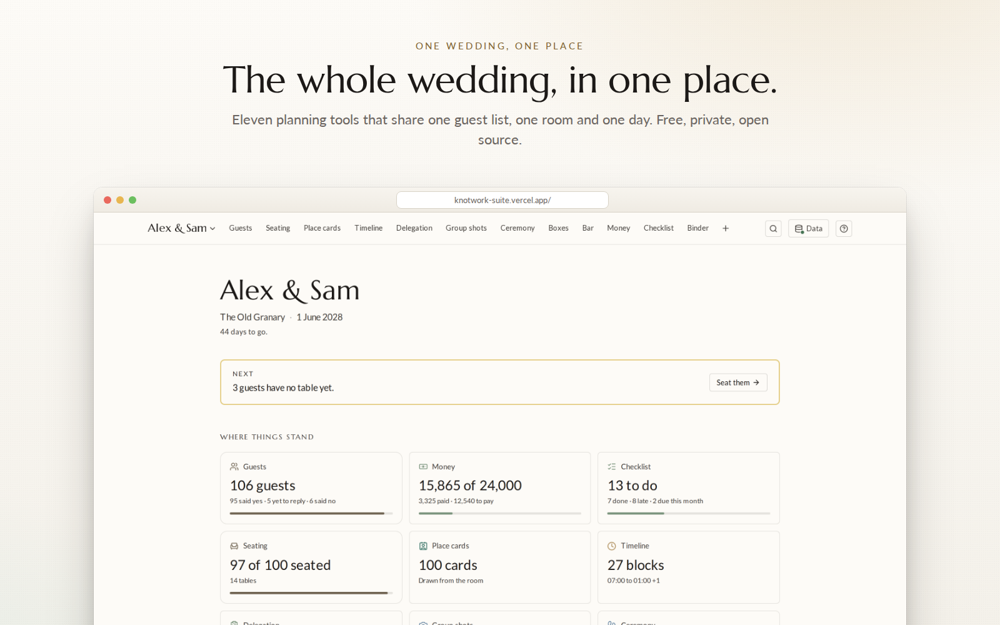
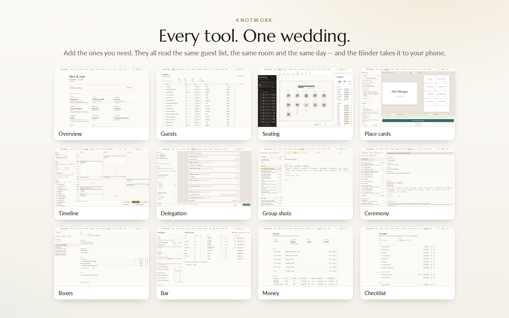
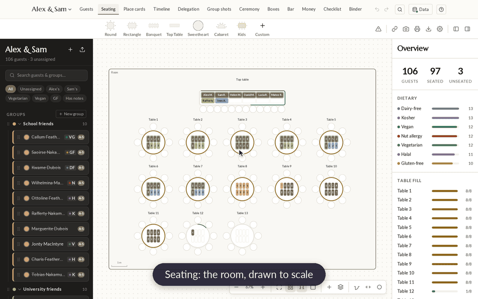
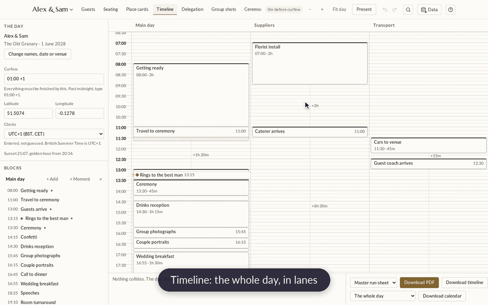
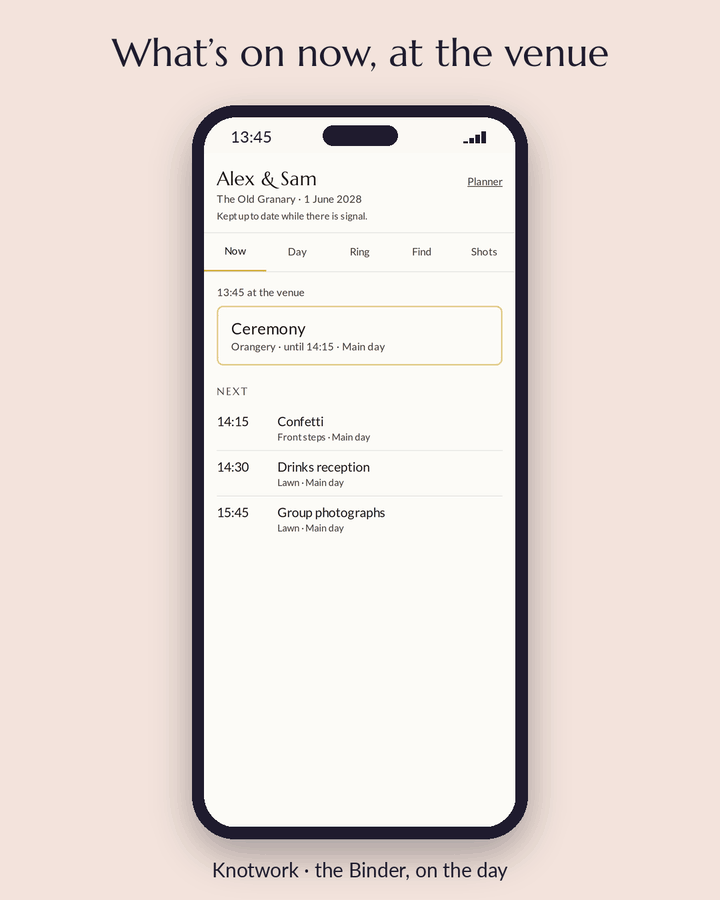
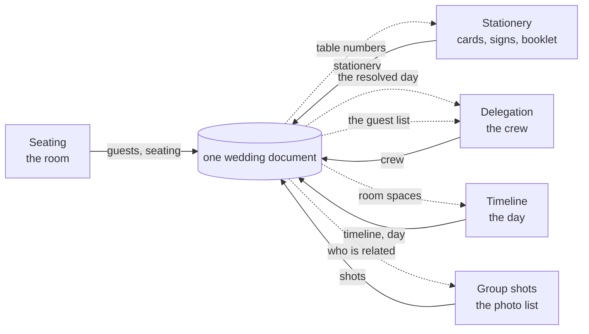

<div align="center">

# Knotwork

Plan a whole wedding in one place, without five tools disagreeing about it.

**Free, open source and private. No paid tier, no ads, no upsell, no sign-up to start.**

<sub>Formerly Trousseau.</sub>

[](LICENSE)
[](https://github.com/JFrusher/Knotwork/stargazers)
[](https://github.com/JFrusher/Knotwork/actions/workflows/ci.yml)
[](docs/SELF-HOSTING.md)
[](https://knotwork-suite.vercel.app)
[](CONTRIBUTING.md)

[**Open Knotwork →**](https://knotwork-suite.vercel.app) &nbsp;·&nbsp;
[Run your own copy](#run-your-own-copy) &nbsp;·&nbsp;
[How it works](#how-it-works) &nbsp;·&nbsp;
[Roadmap](ROADMAP.md) &nbsp;·&nbsp;
[Contribute](CONTRIBUTING.md)



</div>

---

## Why we built this

Wedding software is rarely free. The planning apps are paid for some other
way: vendor marketplaces, registry commissions, adverts, and upsells to the
printed stationery you were about to buy. Your guest list is the asset. It
holds names, emails, family relationships, and dietary needs that are
sometimes medical.

The tools also don't talk to each other. The seating chart, the place cards
and the run sheet end up as three copies of one guest list, drifting apart.
When this project began, two apps disagreed about **what day the wedding
was**.

Knotwork is the opposite of that:

- **Free forever.** Not a trial, not freemium. There is no paid version to be
  upsold to, and the AGPL stops anyone building a closed, paid fork of the
  hosted service.
- **Private by default.** Open it and plan. With no account, your wedding
  stays in your browser and nothing leaves the device.
- **One wedding, many tools.** Every tool reads and writes the same document,
  so a change in one shows up correctly in all the others.

---

## What it does

Seat your guests, and one click puts every table number on the place cards.
Move the ceremony by ten minutes and every job hanging off it moves too.
Nothing is retyped.

### The tools

| | Tool | What it does |
| --- | --- | --- |
| 👥 | **Guests** | The one guest list everything builds on. Import a CSV from Joy, Zola, The Knot or your own spreadsheet. The column mapper guesses what it can and asks about the rest. |
| 🪑 | **Seating** | Draw the room to scale in real units, then put people in it. Keep-together and keep-apart rules, and a live dietary breakdown. |
| 💌 | **Stationery** | Print-ready place cards, table signs and seating boards with table numbers filled in from the room, and the order of service as a folded booklet. |
| 🕒 | **Timeline** | The running order of the day. It shows what collides, what runs past curfew, and what can't be reached in time. |
| 📋 | **Delegation** | The jobs, and who is doing them, hung off each part of the day. |
| 📷 | **Group shots** | The family photo list, built from who is related to whom. |

The six above are there from the start. Add these from the **toolbox** when
your wedding needs them:

| | Tool | What it does |
| --- | --- | --- |
| 💍 | **Ceremony** | Who walks down the aisle, in what order, and to what. The order of service, music and readings, with cues on the Timeline. |
| 📦 | **Boxes** | What is packed in which box, and where each box has to be, by when. |
| 🍷 | **Bar** | How much drink to buy, in bottles and cases, and roughly what it costs. |
| 💷 | **Money** | What each supplier costs, what is paid, and what falls due, against your budget. |
| ✅ | **Checklist** | What to have done before the day, each item with a date. |
| 📱 | **Binder** | The day on your phone: what's on now and next, who to ring, and where a guest sits. Works without signal. |

Removing a tool only hides it. What you made in it stays, and comes back when
you add the tool again.

### Around the tools

- 🖨️ **One PDF pack.** The floor plan, run sheet, job list and group shot list,
  printed from the wedding as it stands.
- 🔗 **Guest and supplier links.** A guest sees their own seat and nothing
  else. A supplier sees their part of the day and can confirm it.
- 🤝 **Plan together.** Two partners and a planner, signing in with a
  six-digit code by email, or with Google or Apple (no passwords). Real-time sync, version history with restore, and conflicts
  are shown, never silently resolved.
- 🗂️ **Planner mode.** Many weddings per account, and a library of reusable
  processionals, box sets and bar settings.
- 🧭 **A guided tour** with a complete example wedding, and a ⌘/Ctrl-K command
  palette.



**Seat a guest, and her place card has her table.** Drag Zainab onto Table 13,
open Stationery, and her card already reads "Table 13".



**Move the ceremony, and the day follows.** Pinned at 13:30, moved to 14:00:
drinks, photos and dinner all move with it. Later still, and it tells you what
no longer fits.



**The Binder, on the day.** What is on now, who to ring, where a guest sits,
and the shot list to tick off, on a phone, with or without signal.

<p align="center"></p>

---

## Get started in two minutes

1. Open **[knotwork-suite.vercel.app](https://knotwork-suite.vercel.app)**.
   There is no sign-up.
2. Press **Data**, and put in your names, your venue and the date.
3. Import your guest list as a CSV.
4. Open **Seating** and drag a few tables onto the canvas.

That is enough to be useful. Everything else builds on it. If you would rather
look around first, the guided tour opens an example wedding with 100 guests
and a full day.

> [!NOTE]
> An account only adds syncing between devices and planning with your partner
> or planner. Sign in with your email and you get a link: no password.

---

## Run your own copy

Self-hosting is a supported path, not a theoretical one. The hosted instance
is the easy option; your own copy gives you your own domain and, with sync,
your own database. Deployments hosted off Vercel have no page analytics;
error reporting only runs if you set a Sentry DSN.

### Local only: no backend, no account

```sh
git clone https://github.com/JFrusher/Knotwork.git Knotwork
cd Knotwork
npm ci             # installs the contract package and the suite together
npm run build      # builds the shared contract package; do not skip this
npm run dev -w suite
```

Open <http://localhost:3000>. Every tool works, and the wedding lives in your
browser's IndexedDB.

### With accounts and sync

Accounts, syncing and guest links need a [Supabase](https://supabase.com)
project. Its free tier is enough for a wedding. In outline:

1. `cp suite/.env.example suite/.env.local` and fill in the four Supabase
   variables.
2. Apply every file in `supabase/migrations/` in filename order. The
   row-level security policies are what keep one couple's wedding from
   another's.
3. `npm run build -w suite && npm start -w suite`, or deploy anywhere that
   runs Next.js.

**On Vercel:** import this repository as a new project, set **Root
Directory** to `suite`, and add the same environment variables. That is how
the hosted instance runs.

**[docs/SELF-HOSTING.md](docs/SELF-HOSTING.md)** covers every environment
variable, the migration order, the two mistakes that catch everyone out, and
how to check your instance actually works rather than merely starting.

> [!NOTE]
> There is no Docker image. That is deliberate: the setup is one Node app and
> an optional Supabase project, and a container would be a second thing to
> maintain rather than a simplification. If you need one, open a discussion
> and say what it would make easier.

---

## Your data

- **No account, no upload.** The app saves to your browser, and nothing from
  your wedding leaves the device. The hosted site counts visits to its pages,
  with no cookie and nothing from the wedding in it. Every address is cut to
  its route first. The [Privacy Policy](https://knotwork-suite.vercel.app/privacy)
  says exactly what is counted.
- **With an account**, your wedding syncs between you, your partner and your
  planner. It is stored encrypted at rest, and database-level rules mean no
  other account can read it.
- **Guest links** show a guest their own seat and nothing else. The server
  stores the page encrypted and serves only ciphertext. The key travels after
  the `#` in the link, which browsers never send to a server. Members of the
  wedding hold the key so they can republish as seats change.
- **You can always take it out.** *Download my wedding* gives you the whole
  thing as one `.knotwork.json` file. That is the same format the app uses,
  so it opens straight back into Knotwork, hosted or on your own copy.
- **Deleting your account deletes your data.** If your partner is still on the
  wedding, it stays with them. If you were the last one, it goes.

> [!IMPORTANT]
> There is no admin panel and no support login, so nobody browses weddings.
> The database is encrypted at rest, **not end to end**: whoever runs an
> instance administers its database and could read what is in it, and the
> Privacy Policy says so plainly. That is why support is "send us a
> screenshot" rather than "let me look at your account", why the app works
> in full without an account, and why you can run your own.

---

## How it works

### One document, one owner per slice

The rule everything rests on:

> A tool rewrites **only its own slice**, and copies every other key
> byte-for-byte, including keys belonging to tools that do not exist yet.



Solid lines are what a tool writes. Dotted lines are what it reads from the
others, and those are the whole point.

`timeline` holds the source of the day: which block is pinned to a time, and
which follows after a gap. `day` holds the clock times those work out to.
Delegation reads the second and never runs a scheduler of its own. That is
why moving the ceremony by ten minutes moves every job hanging off it,
without anything else recalculating.

The merge is enforced in one place, and it works on *raw stored data* rather
than a parsed document. A bug in a schema should at worst refuse a read, never
destroy a write. Unknown keys survive at every level, which is how a new tool
can be added without releasing a new version of the others.

### The day is resolved, not typed

Timeline's resolver is one pure function that the screen and every PDF read.
In each lane, a pinned block starts at its time and a following block starts
where its predecessor ends, plus its gap. When a chain of following blocks
overruns the next pinned time, the overrun is taken out of blocks you marked
as squeezable. Whatever cannot be absorbed is reported as the collision it
is. Travel time between places is checked, and sunset and golden hour are
computed offline, with no network and no timezone database.

### Checks no single tool can run

Each tool sees only its own slice, so the interesting problems live between
them.

| | |
| --- | --- |
| 🔴 error | two parts of the wedding claiming different dates |
| 🔴 error | one seat holding two people |
| 🔴 error | a table holding a guest who does not exist |
| 🔴 error | a table over its own capacity |
| 🔴 error | a guest and their table disagreeing about where they sit |
| 🔴 error | a day block in a lane that does not exist |
| 🟡 warning | confirmed guests with no table, or no dietary answer |

The front page runs its own version and shows what is left to do.

### The stack

**Next.js 16** (App Router) · **React 19** · **TypeScript** · **Zustand** ·
**zod 4** · **Tailwind CSS 4** · **Supabase** (Postgres with row-level
security, email-code auth) · **pdf-lib / jsPDF** for print · **Vitest**,
**Playwright** and **axe** for tests.

```text
suite/           the web application (AGPL-3.0-or-later)
  apps/          Seating, Stationery, Timeline, Delegation
  lib/           the shared document, sync, accounts, and the newer tools
  components/    the shell around the tools, and the newer tools' panels
  app/           routes, API, account, guest and supplier pages
src/             the data contract, published as @jfrusher/knotwork (MIT)
supabase/        database migrations
docs/            self-hosting, building a tool, and dated specs and plans
```

---

## Contributing

Issues and pull requests are welcome. **[CONTRIBUTING.md](CONTRIBUTING.md)**
has the setup, the checks CI runs, and how to report a bug without sharing
anyone's personal details.

- **Found a bug?** Open an issue with what you did and what happened.
  **Never paste your guest list.** A screenshot with names blurred is plenty.
- **Want to change something?** Design decisions are written down in
  `docs/superpowers/specs/`, so you can tell whether an idea fits before
  writing code.
- **Want to build a tool?** A job nothing in Knotwork does for you yet is the
  best reason to. **[docs/BUILDING-A-TOOL.md](docs/BUILDING-A-TOOL.md)** walks
  through the whole journey.

## Roadmap

Everything in the plan up to now is built: eleven tools, accounts, real-time
sync, planner mode and the Binder. Next come tools feeding each other. Boxes
will appear on job sheets, Bar spend will count against the budget, and
Ceremony will show on the Binder. **[ROADMAP.md](ROADMAP.md)** has the
milestones and the issues to pick up.

---

## Where this came from

Knotwork was built for one specific wedding. That is the only reason its
constraints were ever honest: real guest names and dietary requirements,
tools that genuinely must not overwrite each other, and a date that does not
move.

That wedding has happened. Knotwork is now being built for other couples,
which is why it grew accounts, real cloud storage and a self-hosting story.
The design did not change, because the design was the part that was working.

---

## Licence

Two licences, because this repository holds two different things.

- The **application**, everything in `suite/`, is
  **[AGPL-3.0-or-later](LICENSE-AGPL)**. Run it, change it, host it for
  friends. If you host a modified version for other people, they are entitled
  to your source too.
- The **contract package**, `@jfrusher/knotwork`, is **[MIT](LICENSE-MIT)**.
  It holds the schemas and the file format, kept permissive on purpose so that
  a tool nobody has written yet can depend on it.

Fonts are under the SIL Open Font Licence; see the `OFL-*.txt` files beside
them.

There is no paid tier and there never will be. That is the reason this exists.

<div align="center">

**If Knotwork saves you an evening with a spreadsheet, a ⭐ helps other couples find it.**

</div>
